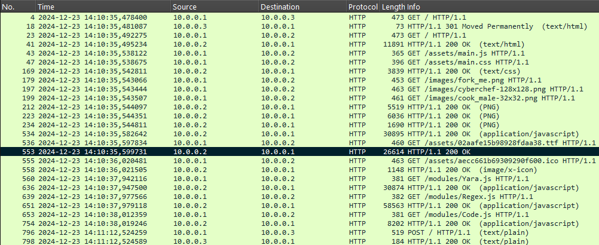
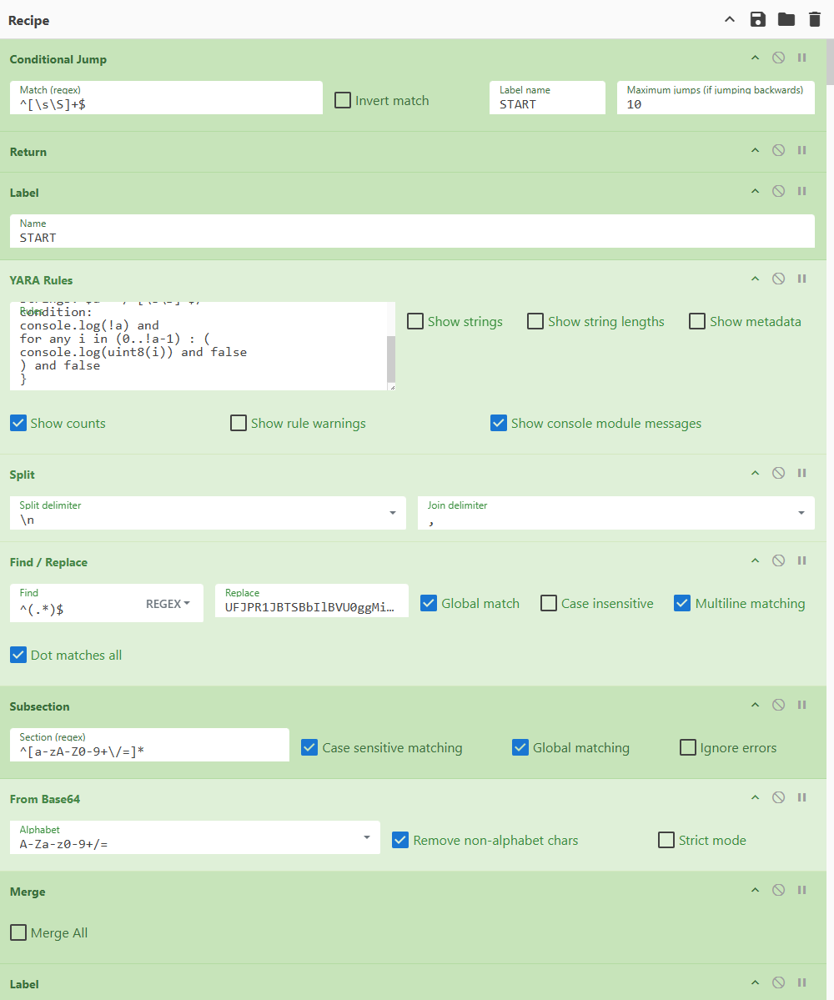
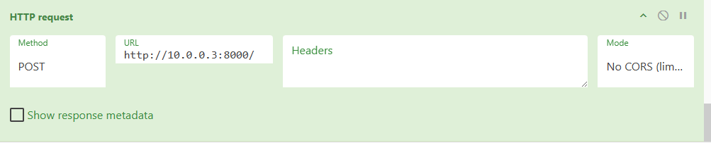

# Tartarus

*Forensics* - *Computer Networks* - *Cyberchef*

[Link to Challenge](https://jscu.summerschool.sh/challenges/challenge-2)

>### Description
>Toen Sisyphus aankwam in de Tartarus om voor eeuwig een rotsblok een steile berg op te duwen, was een programmeur met CyberChef het enige wat hij daar aan trof. Bekijk dit netwerkverkeer en zoek de flag.

## Solution


### Recon

We can analyse `tartarus.pcap` using [Wireshark](https://www.wireshark.org/). When we first open the file it looks like a whole bunch of tcp and http connections between 10.0.0.1, 10.0.0.2, and 10.0.0.3. To simplify the analysing process, we can filter on `http`:




### Encoding algorithm

The response of the first request is a `301 Moved Permanaently`, which includes the redirection url `Location: http://10.0.0.2:8000/#recipe=Conditional_Jump%28...%2Cfalse%29`. The next GET request made by 10.0.0.1 does not include the fragment (the part after the hashtag), because that is handled by the browser of the client. This is the whole fragment:

```txt
#recipe=Conditional_Jump%28%27%5E%5B%5C%5Cs%5C%5CS%5D%2B%24%27%2Cfalse%2C%27START%27%2C10%29Return%28%29Label%28%27START%27%29YARA_Rules%28%27import+%22console%22%5Cn%5Cnrule+x+%7B%5Cnstrings%3A+%24a+%3D+%2F%5E%5B%5C%5Cs%5C%5CS%5D%2A%24%2F%5Cncondition%3A%5Cnconsole.log%28%21a%29+and%5Cnfor+any+i+in+%280..%21a-1%29+%3A+%28%5Cnconsole.log%28uint8%28i%29%29+and+false%5Cn%29+and+false%5Cn%7D%27%2Cfalse%2Cfalse%2Cfalse%2Ctrue%2Cfalse%2Ctrue%29Split%28%27%5C%5Cn%27%2C%27%2C+%27%29Find_%2F_Replace%28%7B%27option%27%3A%27Regex%27%2C%27string%27%3A%27%5E%28.%2A%29%24%27%7D%2C%27UFJPR1JBTSBbIlBVU0ggMiIsICJMT0FEIiwgIlBVU0ggMSIsICJMT0FEIiwgIlNVQiIsICJKQSA3IiwgIkVYSVQiLCAgIlBVU0ggMCIsICJMT0FEIiwgIlBVU0ggMTEwMzUxNTI0NSIsICJNVUwiLCAiUFVTSCAxMjM0NSIsICJBREQiLCAiUFVTSCAyMTQ3NDgzNjQ3IiwgIkFORCIsICJQVVNIIDAiLCAiU1dBUCIsICJTVE9SRSIsICJQVVNIIDAiLCAiTE9BRCIsICJQVVNIIDI1NSIsICJBTkQiLCAiUFVTSCAxIiwgIkxPQUQiLCAiUFVTSCAzIiwgIkFERCIsICJMT0FEIiwgIkFERCIsICJQVVNIIDI1NSIsICJBTkQiLCAiUFVTSCAxIiwgIkxPQUQiLCAiUFVTSCAzIiwgIkFERCIsICJTV0FQIiwgIlNUT1JFIiwgIlBVU0ggMSIsICJMT0FEIiwgIlBVU0ggMSIsICJBREQiLCAiUFVTSCAxIiwgIlNXQVAiLCAiU1RPUkUiLCAiSk1QIDAiXQpQQyAwClNUQUNLIFswXQpIRUFQIFs4Mzg2MTA5ODI1MzE3MjM4MTMxLCAw%2C+%2410%5D%27%2Ctrue%2Cfalse%2Ctrue%2Ctrue%29Subsection%28%27%5E%5Ba-zA-Z0-9%2B%5C%5C%2F%3D%5D%2A%27%2Ctrue%2Ctrue%2Cfalse%29From_Base64%28%27A-Za-z0-9%2B%2F%3D%27%2Ctrue%2Cfalse%29Merge%28false%29Label%28%27DISPATCH%27%29Find_%2F_Replace%28%7B%27option%27%3A%27Regex%27%2C%27string%27%3A%27%28PROGRAM+%5C%5C%5B%29%28.%2A%3F%5C%5C%5D%29%28.%2APC+%29%28%5C%5Cd%2B%29%27%7D%2C%27%241%242+%23%5B%244%2C+%242%243%244%27%2Ctrue%2Cfalse%2Ctrue%2Ctrue%29Subsection%28%27%23%28%5C%5C%5B.%2A%3F%5C%5C%5D%29%27%2Ctrue%2Ctrue%2Cfalse%29JPath_expression%28%27%24%5B%28%40root%5B0%5D%2B1%29%5D%27%2C%27%5C%5Cn%27%29Find_%2F_Replace%28%7B%27option%27%3A%27Regex%27%2C%27string%27%3A%27%22%27%7D%2C%27%27%2Ctrue%2Cfalse%2Ctrue%2Cfalse%29Merge%28false%29Conditional_Jump%28%27%23EXIT%27%2Cfalse%2C%27EXIT%27%2C1e10%29Conditional_Jump%28%27%23SWAP%27%2Cfalse%2C%27SWAP%27%2C1e10%29Conditional_Jump%28%27%23PUSH%27%2Cfalse%2C%27PUSH%27%2C1e10%29Conditional_Jump%28%27%23JMP%27%2Cfalse%2C%27JMP%27%2C1e10%29Conditional_Jump%28%27%23JE%27%2Cfalse%2C%27JE%27%2C1e10%29Conditional_Jump%28%27%23JA%27%2Cfalse%2C%27JA%27%2C1e10%29Conditional_Jump%28%27%23JB%27%2Cfalse%2C%27JB%27%2C1e10%29Conditional_Jump%28%27%23LOAD%27%2Cfalse%2C%27LOAD%27%2C1e10%29Conditional_Jump%28%27%23STORE%27%2Cfalse%2C%27STORE%27%2C1e10%29Conditional_Jump%28%27%23ADD%27%2Cfalse%2C%27ADD%27%2C1e10%29Conditional_Jump%28%27%23SUB%27%2Cfalse%2C%27SUB%27%2C1e10%29Conditional_Jump%28%27%23MUL%27%2Cfalse%2C%27MUL%27%2C1e10%29Conditional_Jump%28%27%23DIV%27%2Cfalse%2C%27DIV%27%2C1e10%29Conditional_Jump%28%27%23XOR%27%2Cfalse%2C%27XOR%27%2C1e10%29Conditional_Jump%28%27%23AND%27%2Cfalse%2C%27AND%27%2C1e10%29Conditional_Jump%28%27%23OR%27%2Cfalse%2C%27OR%27%2C1e10%29Conditional_Jump%28%27%23SHL%27%2Cfalse%2C%27SHL%27%2C1e10%29Conditional_Jump%28%27%23SHR%27%2Cfalse%2C%27SHR%27%2C1e10%29Return%28%29Label%28%27DISPATCH2%27%29Subsection%28%27PC+%28%5C%5Cd%2B%29%27%2Ctrue%2Ctrue%2Cfalse%29Find_%2F_Replace%28%7B%27option%27%3A%27Regex%27%2C%27string%27%3A%27%28%5C%5Cd%2B%29%27%7D%2C%27%241+1%27%2Ctrue%2Cfalse%2Ctrue%2Cfalse%29Sum%28%27Space%27%29Merge%28false%29Label%28%27DISPATCH3%27%29Find_%2F_Replace%28%7B%27option%27%3A%27Regex%27%2C%27string%27%3A%27+%23.%2A%27%7D%2C%27%27%2Ctrue%2Cfalse%2Ctrue%2Cfalse%29Jump%28%27DISPATCH%27%2C1e10%29Label%28%27SWAP%27%29Subsection%28%27STACK+%5C%5C%5B%28-%3F%5C%5Cd%2B%2C+-%3F%5C%5Cd%2B%29%27%2Ctrue%2Ctrue%2Cfalse%29Find_%2F_Replace%28%7B%27option%27%3A%27Regex%27%2C%27string%27%3A%27%28.%2A%29%28%2C+%29%28.%2A%29%27%7D%2C%27%243%242%241%27%2Ctrue%2Cfalse%2Ctrue%2Cfalse%29Merge%28false%29Jump%28%27DISPATCH2%27%29Label%28%27PUSH%27%29Find_%2F_Replace%28%7B%27option%27%3A%27Regex%27%2C%27string%27%3A%27%28%23PUSH+%29%28-%3F%5C%5Cd%2B%29%28.%2ASTACK+%5C%5C%5B%29%27%7D%2C%27%241%242%243%242%2C+%27%2Ctrue%2Cfalse%2Ctrue%2Ctrue%29Jump%28%27DISPATCH2%27%29Label%28%27JMP%27%29Find_%2F_Replace%28%7B%27option%27%3A%27Regex%27%2C%27string%27%3A%27%28%23JMP+%29%28%5C%5Cd%2B%29%28.%2APC+%29%28%5C%5Cd%2B%29%27%7D%2C%27%241%242%243%242%27%2Ctrue%2Cfalse%2Ctrue%2Ctrue%29Jump%28%27DISPATCH3%27%2C1e10%29Label%28%27JE%27%29Conditional_Jump%28%27STACK+%5C%5C%5B0%27%2Ctrue%2C%27JE2%27%2C10%29Find_%2F_Replace%28%7B%27option%27%3A%27Regex%27%2C%27string%27%3A%27%28%23JE+%29%28%5C%5Cd%2B%29%28.%2APC+%29%28%5C%5Cd%2B%29%27%7D%2C%27%241%242%243%242%27%2Ctrue%2Cfalse%2Ctrue%2Ctrue%29Find_%2F_Replace%28%7B%27option%27%3A%27Regex%27%2C%27string%27%3A%27%28STACK+%5C%5C%5B%29-%3F%5C%5Cd%2B%2C+%27%7D%2C%27%241%27%2Ctrue%2Cfalse%2Ctrue%2Cfalse%29Jump%28%27DISPATCH3%27%2C1e10%29Label%28%27JE2%27%29Find_%2F_Replace%28%7B%27option%27%3A%27Regex%27%2C%27string%27%3A%27%28STACK+%5C%5C%5B%29-%3F%5C%5Cd%2B%2C+%27%7D%2C%27%241%27%2Ctrue%2Cfalse%2Ctrue%2Cfalse%29Jump%28%27DISPATCH2%27%2C1e10%29Label%28%27JA%27%29Conditional_Jump%28%27STACK+%5C%5C%5B%5B1-9%5D%27%2Ctrue%2C%27JA2%27%2C10%29Find_%2F_Replace%28%7B%27option%27%3A%27Regex%27%2C%27string%27%3A%27%28%23JA+%29%28%5C%5Cd%2B%29%28.%2APC+%29%28%5C%5Cd%2B%29%27%7D%2C%27%241%242%243%242%27%2Ctrue%2Cfalse%2Ctrue%2Ctrue%29Find_%2F_Replace%28%7B%27option%27%3A%27Regex%27%2C%27string%27%3A%27%28STACK+%5C%5C%5B%29-%3F%5C%5Cd%2B%2C+%27%7D%2C%27%241%27%2Ctrue%2Cfalse%2Ctrue%2Cfalse%29Jump%28%27DISPATCH3%27%2C1e10%29Label%28%27JA2%27%29Find_%2F_Replace%28%7B%27option%27%3A%27Regex%27%2C%27string%27%3A%27%28STACK+%5C%5C%5B%29-%3F%5C%5Cd%2B%2C+%27%7D%2C%27%241%27%2Ctrue%2Cfalse%2Ctrue%2Cfalse%29Jump%28%27DISPATCH2%27%2C1e10%29Label%28%27JB%27%29Conditional_Jump%28%27STACK+%5C%5C%5B-%27%2Ctrue%2C%27JB2%27%2C10%29Find_%2F_Replace%28%7B%27option%27%3A%27Regex%27%2C%27string%27%3A%27%28%23JB+%29%28%5C%5Cd%2B%29%28.%2APC+%29%28%5C%5Cd%2B%29%27%7D%2C%27%241%242%243%242%27%2Ctrue%2Cfalse%2Ctrue%2Ctrue%29Find_%2F_Replace%28%7B%27option%27%3A%27Regex%27%2C%27string%27%3A%27%28STACK+%5C%5C%5B%29-%3F%5C%5Cd%2B%2C+%27%7D%2C%27%241%27%2Ctrue%2Cfalse%2Ctrue%2Cfalse%29Jump%28%27DISPATCH3%27%2C1e10%29Label%28%27JB2%27%29Find_%2F_Replace%28%7B%27option%27%3A%27Regex%27%2C%27string%27%3A%27%28STACK+%5C%5C%5B%29-%3F%5C%5Cd%2B%2C+%27%7D%2C%27%241%27%2Ctrue%2Cfalse%2Ctrue%2Cfalse%29Jump%28%27DISPATCH2%27%2C1e10%29Label%28%27LOAD%27%29Subsection%28%27STACK+%5C%5C%5B%28%5C%5Cd%2B%29%27%2Ctrue%2Ctrue%2Cfalse%29Find_%2F_Replace%28%7B%27option%27%3A%27Regex%27%2C%27string%27%3A%27%28%5C%5Cd%2B%29%27%7D%2C%27%241+1%27%2Ctrue%2Cfalse%2Ctrue%2Cfalse%29Sum%28%27Space%27%29Merge%28false%29Subsection%28%27HEAP+%5C%5C%5B%28.%2A%3F%29%5C%5C%5D%27%2Ctrue%2Ctrue%2Cfalse%29Find_%2F_Replace%28%7B%27option%27%3A%27Regex%27%2C%27string%27%3A%27+%27%7D%2C%27%27%2Ctrue%2Cfalse%2Ctrue%2Cfalse%29Split%28%27%2C%27%2C%27%5C%5Cn%27%29Add_line_numbers%28%29Merge%28false%29Find_%2F_Replace%28%7B%27option%27%3A%27Regex%27%2C%27string%27%3A%27%28STACK+%5C%5C%5B%29%28%5C%5Cd%2B%29%28.%2A%29%28%5C%5Cb%5C%5C2+%29%28-%3F%5C%5Cd%2B%29%27%7D%2C%27%241%245%243%244%245%27%2Ctrue%2Cfalse%2Ctrue%2Ctrue%29Subsection%28%27HEAP+%5C%5C%5B%28%5B%5C%5Cs%5C%5CS%5D%2A%29%5C%5C%5D%27%2Ctrue%2Ctrue%2Cfalse%29Remove_line_numbers%28%29Split%28%27%5C%5Cn%27%2C%27%2C+%27%29Merge%28false%29Jump%28%27DISPATCH2%27%2C1e10%29Label%28%27STORE%27%29Find_%2F_Replace%28%7B%27option%27%3A%27Regex%27%2C%27string%27%3A%27%28STACK+%5C%5C%5B-%3F%5C%5Cd%2B%2C+%29%27%7D%2C%27%2411%3A%27%2Ctrue%2Cfalse%2Ctrue%2Cfalse%29Subsection%28%27%28%5C%5Cd%2B%3A%5C%5Cd%2B%29%27%2Cfalse%2Cfalse%2Cfalse%29Sum%28%27Colon%27%29Merge%28false%29Subsection%28%27HEAP+%5C%5C%5B%28.%2A%3F%29%5C%5C%5D%27%2Ctrue%2Ctrue%2Cfalse%29Find_%2F_Replace%28%7B%27option%27%3A%27Regex%27%2C%27string%27%3A%27+%27%7D%2C%27%27%2Ctrue%2Cfalse%2Ctrue%2Cfalse%29Split%28%27%2C%27%2C%27%5C%5Cn%27%29Add_line_numbers%28%29Merge%28false%29Find_%2F_Replace%28%7B%27option%27%3A%27Regex%27%2C%27string%27%3A%27%28STACK+%5C%5C%5B%29%28-%3F%5C%5Cd%2B%29%28%2C+%29%28%5C%5Cd%2B%29%28.%2A%29%28%5C%5Cb%5C%5C4+%29%28-%3F%5C%5Cd%2B%29%27%7D%2C%27%241%242%243%244%245%246%242%27%2Ctrue%2Cfalse%2Ctrue%2Ctrue%29Subsection%28%27HEAP+%5C%5C%5B%28%5B%5C%5Cs%5C%5CS%5D%2A%29%5C%5C%5D%27%2Ctrue%2Ctrue%2Cfalse%29Remove_line_numbers%28%29Split%28%27%5C%5Cn%27%2C%27%2C+%27%29Merge%28false%29Find_%2F_Replace%28%7B%27option%27%3A%27Regex%27%2C%27string%27%3A%27%28STACK+%5C%5C%5B%29%28-%3F%5C%5Cd%2B%2C+%29%7B2%7D%27%7D%2C%27%241%27%2Ctrue%2Cfalse%2Ctrue%2Cfalse%29Jump%28%27DISPATCH2%27%2C1e10%29Label%28%27ADD%27%29Subsection%28%27STACK+%5C%5C%5B%28-%3F%5C%5Cd%2B%2C+-%3F%5C%5Cd%2B%29%27%2Ctrue%2Ctrue%2Cfalse%29Sum%28%27Comma%27%29Merge%28false%29Jump%28%27DISPATCH2%27%2C1e10%29Label%28%27SUB%27%29Subsection%28%27STACK+%5C%5C%5B%28-%3F%5C%5Cd%2B%2C+-%3F%5C%5Cd%2B%29%27%2Ctrue%2Ctrue%2Cfalse%29Find_%2F_Replace%28%7B%27option%27%3A%27Regex%27%2C%27string%27%3A%27%28.%2A%29%28%2C+%29%28.%2A%29%27%7D%2C%27%243%242%241%27%2Ctrue%2Cfalse%2Ctrue%2Cfalse%29Subtract%28%27Comma%27%29Merge%28false%29Jump%28%27DISPATCH2%27%2C1e10%29Label%28%27MUL%27%29Subsection%28%27STACK+%5C%5C%5B%28-%3F%5C%5Cd%2B%2C+-%3F%5C%5Cd%2B%29%27%2Ctrue%2Ctrue%2Cfalse%29Multiply%28%27Comma%27%29Merge%28false%29Jump%28%27DISPATCH2%27%2C1e10%29Label%28%27DIV%27%29Subsection%28%27STACK+%5C%5C%5B%28-%3F%5C%5Cd%2B%2C+-%3F%5C%5Cd%2B%29%27%2Ctrue%2Ctrue%2Cfalse%29Find_%2F_Replace%28%7B%27option%27%3A%27Regex%27%2C%27string%27%3A%27%28.%2A%29%28%2C+%29%28.%2A%29%27%7D%2C%27%243%242%241%27%2Ctrue%2Cfalse%2Ctrue%2Cfalse%29Divide%28%27Comma%27%29Find_%2F_Replace%28%7B%27option%27%3A%27Regex%27%2C%27string%27%3A%27%5C%5C..%2A%27%7D%2C%27%27%2Ctrue%2Cfalse%2Ctrue%2Cfalse%29Merge%28false%29Jump%28%27DISPATCH2%27%2C1e10%29Label%28%27XOR%27%29Subsection%28%27STACK+%5C%5C%5B%28-%3F%5C%5Cd%2B%2C+-%3F%5C%5Cd%2B%29%27%2Ctrue%2Ctrue%2Cfalse%29Fork%28%27%2C%27%2C%27+%27%2Cfalse%29To_Base%282%29Reverse%28%27Byte%27%29Merge%28false%29YARA_Rules%28%27import+%22math%22%5Cnimport+%22console%22%5Cn%5Cnrule+x+%7B%5Cnstrings%3A+%24a%3D%2F%5E%5C%5Cb%5C%5Cd%2B%5C%5Cb%2F+%24b%3D%2F%5C%5Cb%5C%5Cd%2B%5C%5Cb%24%2F%5Cncondition%3A%5Cn%5Cnfor+any+i+in+%280..math.max%28%21a%2C%21b%29-1%29+%3A+%28%5Cn%28%5Cn%28i+%3E%3D+%21a+and+console.log%28uint8%28%40b%2Bi%29%261%29%29+or%5Cn%28i+%3E%3D+%21b+and+console.log%28uint8%28%40a%2Bi%29%261%29%29+or%5Cnconsole.log%28uint8%28%40a%2Bi%29%5Euint8%28%40b%2Bi%29%29%5Cn%29+and+false%5Cn%29%5Cn%7D%27%2Cfalse%2Cfalse%2Cfalse%2Cfalse%2Cfalse%2Ctrue%29Split%28%27%5C%5Cn%27%2C%27%27%29Reverse%28%27Byte%27%29From_Base%282%29Merge%28false%29Jump%28%27DISPATCH2%27%2C1e10%29Label%28%27AND%27%29Subsection%28%27STACK+%5C%5C%5B%28-%3F%5C%5Cd%2B%2C+-%3F%5C%5Cd%2B%29%27%2Ctrue%2Ctrue%2Cfalse%29Fork%28%27%2C%27%2C%27+%27%2Cfalse%29To_Base%282%29Reverse%28%27Byte%27%29Merge%28false%29YARA_Rules%28%27import+%22math%22%5Cnimport+%22console%22%5Cn%5Cnrule+x+%7B%5Cnstrings%3A+%24a%3D%2F%5E%5C%5Cb%5C%5Cd%2B%5C%5Cb%2F+%24b%3D%2F%5C%5Cb%5C%5Cd%2B%5C%5Cb%24%2F%5Cncondition%3A%5Cn%5Cnfor+any+i+in+%280..math.max%28%21a%2C%21b%29-1%29+%3A+%28%5Cn%28%5Cn%28i+%3E%3D+%21a+and+console.log%280%29%29+or%5Cn%28i+%3E%3D+%21b+and+console.log%280%29%29+or%5Cnconsole.log%28uint8%28%40a%2Bi%29%26uint8%28%40b%2Bi%29%261%29%5Cn%29+and+false%5Cn%29%5Cn%7D%27%2Cfalse%2Cfalse%2Cfalse%2Cfalse%2Cfalse%2Ctrue%29Split%28%27%5C%5Cn%27%2C%27%27%29Reverse%28%27Byte%27%29From_Base%282%29Merge%28false%29Jump%28%27DISPATCH2%27%2C1e10%29Label%28%27OR%27%29Subsection%28%27STACK+%5C%5C%5B%28-%3F%5C%5Cd%2B%2C+-%3F%5C%5Cd%2B%29%27%2Ctrue%2Ctrue%2Cfalse%29Fork%28%27%2C%27%2C%27+%27%2Cfalse%29To_Base%282%29Reverse%28%27Byte%27%29Merge%28false%29YARA_Rules%28%27import+%22math%22%5Cnimport+%22console%22%5Cn%5Cnrule+x+%7B%5Cnstrings%3A+%24a%3D%2F%5E%5C%5Cb%5C%5Cd%2B%5C%5Cb%2F+%24b%3D%2F%5C%5Cb%5C%5Cd%2B%5C%5Cb%24%2F%5Cncondition%3A%5Cn%5Cnfor+any+i+in+%280..math.max%28%21a%2C%21b%29-1%29+%3A+%28%5Cn%28%5Cn%28i+%3E%3D+%21a+and+console.log%28uint8%28%40b%2Bi%29%261%29%29+or%5Cn%28i+%3E%3D+%21b+and+console.log%28uint8%28%40a%2Bi%29%261%29%29+or%5Cnconsole.log%28uint8%28%40a%2Bi%29%261%7Cuint8%28%40b%2Bi%29%261%29%5Cn%29+and+false%5Cn%29%5Cn%7D%27%2Cfalse%2Cfalse%2Cfalse%2Cfalse%2Cfalse%2Ctrue%29Split%28%27%5C%5Cn%27%2C%27%27%29Reverse%28%27Byte%27%29From_Base%282%29Merge%28false%29Jump%28%27DISPATCH2%27%2C1e10%29Label%28%27SHR%27%29Subsection%28%27STACK+%5C%5C%5B%28-%3F%5C%5Cd%2B%2C+-%3F%5C%5Cd%2B%29%27%2Ctrue%2Ctrue%2Cfalse%29Fork%28%27%2C%27%2C%27+%27%2Cfalse%29To_Base%282%29Reverse%28%27Byte%27%29Merge%28false%29Subsection%28%27%5E%28%5C%5Cd%2B%29%27%2Ctrue%2Ctrue%2Cfalse%29YARA_Rules%28%27import+%22math%22%5Cnimport+%22console%22%5Cn%5Cnrule+x+%7B%5Cnstrings%3A+%24a%3D%2F%5C%5Cd%2B%2F%5Cncondition%3A%5Cnconsole.log%280%29+and%5Cnfor+any+i+in+%280..%21a-1%29+%3A+%28%5Cnuint8%28%40a%2Bi%29%261+and+%5Cnfor+any+j+in+%280..%281%3C%3Ci%29-1%29+%3A+%28%5Cnconsole.log%280%29+and+false%5Cn%29%5Cn%29%5Cn%7D%27%2Cfalse%2Cfalse%2Cfalse%2Cfalse%2Cfalse%2Ctrue%29Split%28%27%5C%5Cn%27%2C%27%27%29Merge%28false%29YARA_Rules%28%27import+%22math%22%5Cnimport+%22console%22%5Cn%5Cnrule+x+%7B%5Cnstrings%3A+%24a%3D%2F%5E%5C%5Cb%5C%5Cd%2B%5C%5Cb%2F+%24b%3D%2F%5C%5Cb%5C%5Cd%2B%5C%5Cb%24%2F%5Cncondition%3A%5Cn%5Cnfor+any+i+in+%28%21a-1..%21b-1%29+%3A+%28%5Cnconsole.log%28uint8%28%40b%2Bi%29%261%29+and+false%5Cn%29%5Cn%7D%27%2Cfalse%2Cfalse%2Cfalse%2Cfalse%2Cfalse%2Ctrue%29Split%28%27%5C%5Cn%27%2C%27%27%29Reverse%28%27Byte%27%29From_Base%282%29Merge%28false%29Jump%28%27DISPATCH2%27%2C1e10%29Label%28%27SHL%27%29Subsection%28%27STACK+%5C%5C%5B%28-%3F%5C%5Cd%2B%2C+-%3F%5C%5Cd%2B%29%27%2Ctrue%2Ctrue%2Cfalse%29Fork%28%27%2C%27%2C%27+%27%2Cfalse%29To_Base%282%29Reverse%28%27Byte%27%29Merge%28false%29Subsection%28%27%5E%28%5C%5Cd%2B%29%27%2Ctrue%2Ctrue%2Cfalse%29YARA_Rules%28%27import+%22math%22%5Cnimport+%22console%22%5Cn%5Cnrule+x+%7B%5Cnstrings%3A+%24a%3D%2F%5C%5Cd%2B%2F%5Cncondition%3A%5Cnfor+any+i+in+%280..%21a-1%29+%3A+%28%5Cnuint8%28%40a%2Bi%29%261+and+%5Cnfor+any+j+in+%280..%281%3C%3Ci%29-1%29+%3A+%28%5Cnconsole.log%280%29+and+false%5Cn%29%5Cn%29%5Cn%7D%27%2Cfalse%2Cfalse%2Cfalse%2Cfalse%2Cfalse%2Ctrue%29Split%28%27%5C%5Cn%27%2C%27%27%29Merge%28false%29Split%28%27+%27%2C%27%27%29Reverse%28%27Byte%27%29From_Base%282%29Merge%28false%29Jump%28%27DISPATCH2%27%2C1e10%29Label%28%27EXIT%27%29Find_%2F_Replace%28%7B%27option%27%3A%27Regex%27%2C%27string%27%3A%27.%2AHEAP+%5C%5C%5B%5C%5Cd%2B%2C+%5C%5Cd%2B%2C+%5C%5Cd%2B%2C+%28.%2A%29%2C+0%5C%5C%5D%27%7D%2C%27%241%27%2Ctrue%2Cfalse%2Ctrue%2Ctrue%29From_Charcode%28%27Comma%27%2C10%29To_Base64%28%27A-Za-z0-9%2B%2F%3D%27%29HTTP_request%28%27POST%27%2C%27http%3A%2F%2F10.0.0.3%3A8000%2F%27%2C%27%27%2C%27No+CORS+%28limited+to+HEAD%2C+GET+or+POST%29%27%2Cfalse%29
```

The response is a [cyberchef](https://gchq.github.io/CyberChef/) webpage. This tool saves the encoding algorithm in the url fragment, so we can copy the entire fragment, and paste it to our own browser that is connected to cyberchef. This gives us a huge algorithm that is used:



Notice that the last step sends an http POST request to 10.0.0.3 with the result of the encoding algorithm:



In the .pcap file, we can find the POST request that is made by 10.0.0.1 and extract the value from the body:

```txt
g/57HKG3jS6QMFUTb3TFr6NJKwTrKRo6zJIIC1jfl4gN
```

The flag is probably the input that resulted in this output.


### Decoding

If we remove the last ingredient that makes the http POST request, we can play around with the algorithm to see if there is anything suspicious going on. We also swap out the last "To Base64" for a "To Hex" so we can see the exact output. To compare this to the intercepted value, we encode it from base64 to hex:

```txt
83 fe 7b 1c a1 b7 8d 2e 90 30 55 13 6f 74 c5 af a3 49 2b 04 eb 29 1a 3a cc 92 08 0b 58 df 97 88 0d
```

When playing around with the input a little bit, I noticed that every input character only changes its corresponding output byte. So when we input `SUMMERSCHOOL{`, the result matches the first part of the encoded flag:

```txt
83 fe 7b 1c a1 b7 8d 2e 90 30 55 13 6f
```

So to find the unknown 19 characters of the flag, I use this placeholder `SUMMERSCHOOL{AAAAAAAAAAAAAAAAAAA}`, and I manually brute force every character... This would take a long time since the algorithm takes like 10 seconds per run. However, it looks like all the characters are shifted some number lower or higher according to some key like in a Vigenère cipher. This makes the reversing real easy because the placeholder A's give away the key. I am too tired to solve this manually, so I ~~wrote~~vibecoded a simple python script to solve it for me. [solve.py](./solve.py):

```py
test = 'SUMMERSCHOOL{AAAAAAAAAAAAAAAAAAA}'
test_enc = '83 fe 7b 1c a1 b7 8d 2e 90 30 55 13 6f 5e d3 a4 a1 5a 1f 00 cd 16 2b 1c b9 92 f7 f8 65 ce 83 94 0d'
flag_enc = '83 fe 7b 1c a1 b7 8d 2e 90 30 55 13 6f 74 c5 af a3 49 2b 04 eb 29 1a 3a cc 92 08 0b 58 df 97 88 0d'

test_bytes = bytes.fromhex(test_enc)
flag_bytes = bytes.fromhex(flag_enc)

diffs = [(f - t) for f, t in zip(flag_bytes, test_bytes)]

flag = ''.join(chr((ord(c) + d) % 256) for c, d in zip(test, diffs))

print(flag)
```

<details>
<summary>Yes! We got the flag:</summary> 
SUMMERSCHOOL{W3LC0ME_T0_TART4RU5}
</details>