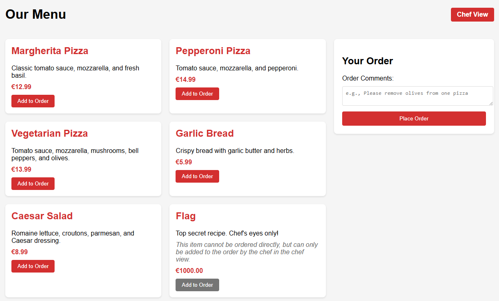
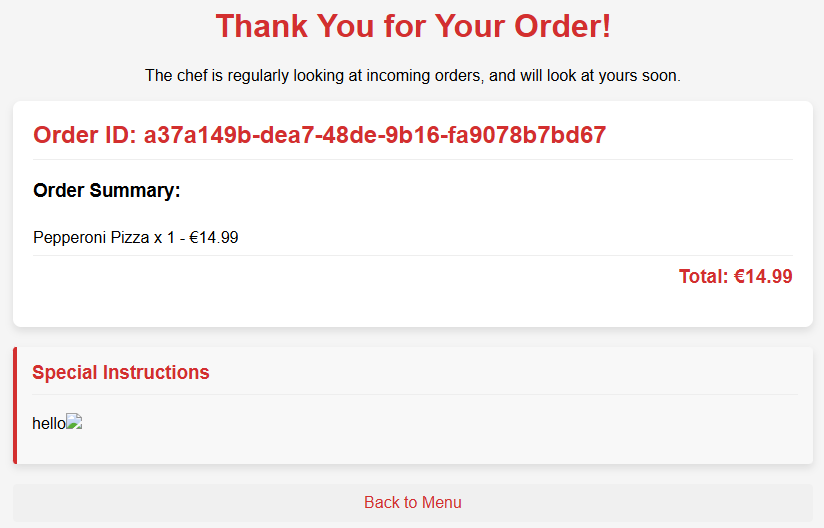

# Cannot Order

*Created by Ruben* - *29 Solves*

[Link to Challenge](https://ctf.tudc.tf/challenges#Cannot%20order-31)

>### Description
>I've always really wanted to order this "Flag" item from the menu, but it won't let me! Can you help me out? 

## Solution

### Recon

When you open the **webpage**, you are greeted with a **simple webshop** where we can order pizzas. Before ordering we can input a **custom comment** on the right side:



Notice we cannot order the **Flag** item. **Only chefs** can access this item. When looking at the source code, we see that the authorization is stored in a `chef_session` **cookie**, which isn't protected by the `http-only` flag (!):

```go
func handleChefLogin(w http.ResponseWriter, r *http.Request) {
    ...
    // Create session
	sessionId := uuid.New().String()
	chefSessions[sessionId] = true

	http.SetCookie(w, &http.Cookie{
		Name:    "chef_session",
		Value:   sessionId,
		Expires: time.Now().Add(100 * time.Hour),
		Path:    "/",
	})
    ...
}
```

The source code also reveals that there is a **bot** that views every order that is being placed, while being **logged in as chef**:

```py
def visit(order_id: str):
    with sync_playwright() as p:
        browser = p.chromium.launch(headless=True)

        page = browser.new_page()

        # Login as chef
        page.goto("http://challenge:8080/chef/login")

        page.locator("id=username").fill("chef")
        page.locator("id=password").fill(chef_password)

        page.get_by_role("button").click()

        # After logging in we are sent to the chef view.
        # In case an order has special instructions, we need to visit the order page itself.
        page.goto(f"http://challenge:8080/order-confirmation?order_id={order_id}")
        sleep(10)

        browser.close()
```

### Vulnerability

The bot visits the `order-confirmation` endpoint. While the `Comment` section is vulnerable to **stored xss**:



### Exploit

Now we can exploit the xss vulnerability in the `Comment` section to **exfiltrate** the authorized `chef_session` cookie from the chef bot using [webhook.site](webhook.site).

This is the **payload** I used:

```html
hi
```

This results in a request being made that leaks the cookies. We can use this cookie in our own browser to essentially become logged in as chef, and finally order the **Flag** from the chefs view!

<details>
<summary>Yes! We got the flag:</summary> 
TUDCTF{BeWaRe-Of_whiCh-7emPl4Te_yOU-imP0RT}
</details>